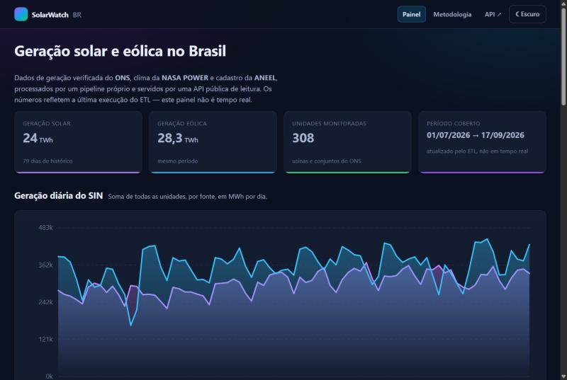
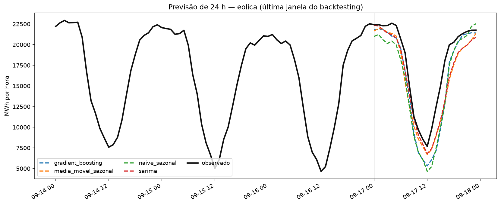
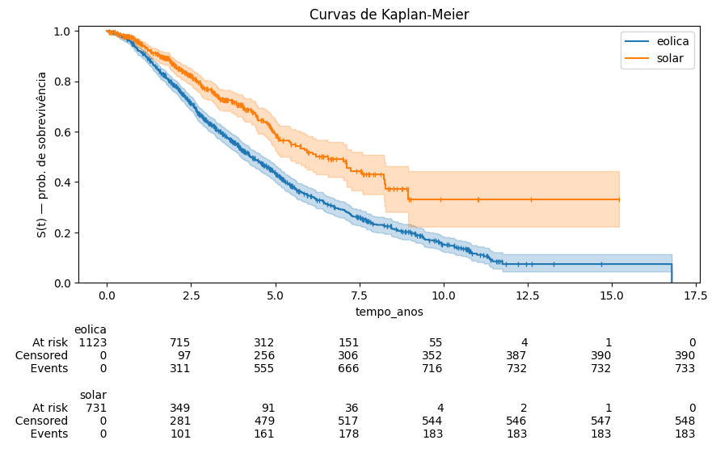
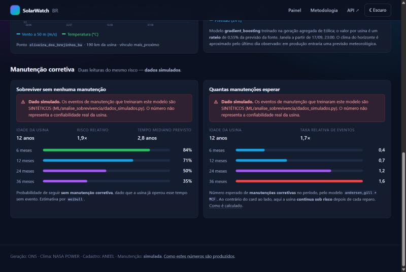

<h1 align="center">☀️ SolarWatch BR</h1>

<p align="center">
  <strong>Da API pública ao painel no ar: um pipeline completo de dados sobre geração solar e eólica no Brasil.</strong><br>
  Ingestão de três fontes oficiais → ETL em camadas → banco analítico → dois modelos de ML → API REST → painel web.
</p>

<p align="center">
  
  
  
  
  
  
  
  
</p>

<p align="center">
  <a href="https://solarwatch-br.onrender.com/app/"></a>
  <a href="https://solarwatch-br.onrender.com/docs"></a>
</p>

<p align="center">
  <sub>Hospedado no plano gratuito do Render, que suspende a instância após inatividade:<br>
  se for a primeira visita em algumas horas, a página leva ~1 minuto para acordar.</sub>
</p>

---

O ONS publica **quanto cada unidade gerou**, hora a hora, mas sem coordenadas e quase sempre por *conjunto* de usinas. A ANEEL cadastra **cada usina individualmente**, com potência e localização, mas não tem geração. A NASA POWER dá **clima por coordenada**, e não sabe o que é uma usina.

Nenhuma das três conversa com as outras. Este projeto faz essa conversa acontecer — e, mais importante, **declara no próprio dado o quanto cada aproximação é confiável**.

[](https://solarwatch-br.onrender.com/app/)

<sub>O painel em produção: KPIs nacionais, geração diária do SIN por fonte e, abaixo, previsão de 24 h e a lista de unidades com filtros.</sub>


<sub>Arquitetura do system design. Na implementação o cadastro da ANEEL acabou vindo pela **API CKAN**, não por scraping — essa e as outras divergências estão registradas na documentação de cada camada.</sub>

## Em números

| | |
|---|---|
| 🔌 **Dados reais** | 1,36 milhão de linhas de geração horária do ONS · 20.511 empreendimentos da ANEEL · 19 pontos de clima da NASA POWER |
| ⭐ **Modelo estrela** | 308 unidades geradoras e 605 mil linhas, num DuckDB de 46 MB construído com *build-then-swap* |
| 📈 **Previsão de 24 h** | RMSE de **832 MWh/h** na solar e **1.701** na eólica — 59% e 38% abaixo do baseline sazonal |
| ⏳ **Sobrevivência de ativos** | Cox estratificado + Weibull AFT, C-index 0,577 (5-fold), servido por usina na API |
| 🧪 **Testes** | **549** automatizados, nenhum tocando a rede ou os dados reais do projeto |
| 📚 **Documentação** | 8 documentos técnicos, um por camada, cada um terminando nas limitações medidas |

> [!WARNING]
> **Os eventos de manutenção são sintéticos.** Não existe base pública de O&M de usinas brasileiras, então o modelo de sobrevivência é treinado sobre um gerador estatístico [documentado em detalhe](docs/ingestao/doc_tecnica_dados_simulados.md). O aviso viaja no próprio payload da API (`"simulado": true`), não só na documentação. **Geração, clima e cadastro são dados reais.**

## O que dá para perguntar

| Pergunta | Endpoint | Experimente |
|---|---|---|
| Quanto esta usina gerou, hora a hora? | `GET /usinas/{id}/geracao` | [▶](https://solarwatch-br.onrender.com/api/v1/usinas/12/geracao?inicio=2026-09-10&fim=2026-09-17) |
| Qual era o vento e a temperatura por perto, e a quantos km? | `GET /usinas/{id}/clima` | [▶](https://solarwatch-br.onrender.com/api/v1/usinas/12/clima) |
| Quanto o país vai gerar nas próximas 24 h? | `GET /geracao/previsao` | [▶](https://solarwatch-br.onrender.com/api/v1/geracao/previsao?fonte=solar) |
| Qual a chance desta usina passar 12 meses sem manutenção? | `GET /usinas/{id}/sobrevivencia` | [▶](https://solarwatch-br.onrender.com/api/v1/usinas/12/sobrevivencia) |
| Quantas manutenções esperar nesse período? | `GET /usinas/{id}/recorrencia` | [▶](https://solarwatch-br.onrender.com/api/v1/usinas/12/recorrencia) |

Tudo somente leitura, paginado por cursor, com erros em [Problem Details (RFC 9457)](https://www.rfc-editor.org/rfc/rfc9457), rate limit por IP, [`/health`](https://solarwatch-br.onrender.com/health), [`/metrics`](https://solarwatch-br.onrender.com/metrics) no formato Prometheus e OpenAPI gerado do código em [`/docs`](https://solarwatch-br.onrender.com/docs).

## Cinco decisões que explicam o projeto

**1. O grão da dimensão é a unidade do ONS, não a usina da ANEEL.** Ratear a geração de um conjunto entre suas usinas (proporcional à potência, por exemplo) daria uma tabela mais bonita e um dado inventado. Em vez disso, o vínculo entre as duas fontes é explícito, auditável e **verificado contra a geração medida**: se o pico observado não for compatível com a potência vinculada, a potência simplesmente **não é publicada** e o campo `qualidade_vinculo` diz por quê. → [ETL §8.2](docs/ETL/doc_tecnica_etl.md#821-a-decisão-de-grão)

**2. Buraco de 3 horas na série é interpolado; de 4, não.** O `interpolate(limit=3)` do pandas preencheria as três primeiras horas de um buraco de 24 e devolveria meia série sintética sem avisar. Aqui o tamanho de cada buraco é medido **antes** de decidir, e existe um teste que compara os dois comportamentos lado a lado para que a diferença não se perca. → [ETL §6.3](docs/ETL/doc_tecnica_etl.md#63-interpolar_gaps_curtosdf-chave-colunas-max_gap)

**3. Vazamento temporal é impossível por construção.** Toda defasagem usada como feature é **maior ou igual ao horizonte de previsão** — a função levanta `ValueError` se alguém tentar o contrário. É o erro que faz o backtesting parecer ótimo e a produção desabar, e aqui ele não compila. → [séries temporais §5.1](docs/ML/doc_tecnica_series_temporais.md#51-garantia-anti-vazamento)

**4. Importância por permutação pode errar por duas ordens de grandeza.** Ela dizia que o clima valia **0,4%** na previsão solar. Uma ablação no backtesting (treinar sem as colunas de clima) mostrou que ele vale **21% do RMSE**. São perguntas diferentes — "do que o modelo ajustado depende" não é "o que vale a pena coletar" — e só a segunda interessa a quem decide onde investir. → [séries temporais §10](docs/ML/doc_tecnica_series_temporais.md#10-importância-das-features)

**5. Uma usina de 12 anos aparecia com 100% de chance de não falhar.** A linha de base do Cox fica plana depois do último evento com massa amostral, e a extrapolação caía exatamente ali. A correção foi exigir 20 unidades em risco para o limite de suporte e usar uma Weibull AFT além dele — com três testes de regressão guardando o caso. → [sobrevivência §10](docs/ML/doc_tecnica_analise_sobrevivencia.md#10-o-bug-da-extrapolação-e-como-foi-resolvido)

## Resultados

### Previsão de geração (24 h à frente)

Quatro modelos na mesma interface, comparados por **backtesting de janela deslizante** (6 janelas × 24 h, sempre treinando só com o passado da janela):

| Modelo | RMSE eólica | RMSE solar | Ganho sobre o baseline |
|---|---:|---:|---:|
| **Gradient Boosting** | **1.701** | **832** | **+38,1% / +59,0%** |
| SARIMA | 2.114 | 1.601 | +23,0% / +21,0% |
| Média móvel sazonal | 2.386 | 1.414 | +13,1% / +30,3% |
| Naive sazonal (baseline) | 2.747 | 2.027 | — |



<sub>Última janela do backtesting da eólica: o Gradient Boosting (azul) acompanha a queda do vento que o baseline sazonal (verde) exagera.</sub>

### Sobrevivência de ativos (dado simulado)

Kaplan-Meier, comparação de distribuições paramétricas por AIC, **Cox estratificado por fonte** — porque as linhas de base de solar e eólica não são proporcionais entre si — e Weibull AFT para extrapolar além do suporte observado. A API serve probabilidade **condicional na idade**: quem já operou cinco anos sem evento não parte do zero.



O módulo vai além do primeiro evento: **Andersen-Gill**, **PWP** e a **Função Média Cumulativa** respondem *quantas* manutenções esperar, com fragilidade gama por usina estimada via binomial negativa — a diferença entre tratar como iguais a usina nova e a que já foi reparada cinco vezes.

## O painel

🔗 **[solarwatch-br.onrender.com/app](https://solarwatch-br.onrender.com/app/)**

Três páginas em HTML, CSS e JavaScript puros — **zero dependências, zero build step** — servidas pelo próprio backend em `/app`:

- **painel:** KPIs nacionais, geração diária do SIN, previsão de 24 h e a lista de unidades com filtros de fonte, tipo e subsistema;
- **usina:** cadastro, série horária, clima com a distância do ponto de medição, previsão e dois cards de manutenção (probabilidade e contagem esperada);
- **metodologia:** por que algumas usinas aparecem "sem cadastro", como os buracos de série são tratados e o que é simulado.

[](https://solarwatch-br.onrender.com/app/usina.html?id=12)

<sub>Os dois cards de manutenção de um conjunto eólico de 12 anos — probabilidade de sobreviver sem manutenção e número esperado de manutenções, cada um com o aviso de dado simulado que a própria API devolve. Esta é a usina do bug da extrapolação: note o <code>weibull</code> como método.</sub>

Gráficos SVG escritos à mão (`js/graficos.js`), tema claro/escuro, formatação `Intl` em pt-BR e estados de erro que mostram a mensagem da API em vez de uma tela em branco.

## Stack

| Camada | Ferramentas |
|---|---|
| **Ingestão** | `requests` com retry/backoff e jitter, Parquet + `pyarrow`, escrita atômica |
| **ETL** | `pandas`, arquitetura medalhão (raw → clean → curated), validação antes de gravar |
| **Banco** | `DuckDB` com esquema declarativo (PK, FK, NOT NULL, índices, views) e MER gerado do código |
| **ML** | `scikit-learn` (Gradient Boosting), `statsmodels` (SARIMA, binomial negativa), `lifelines` (Cox, Weibull, Kaplan-Meier, Andersen-Gill) |
| **API** | `FastAPI` + `pydantic-settings`, paginação por cursor, Problem Details, rate limit próprio, logs JSON |
| **Frontend** | HTML + CSS + JavaScript (ES modules), SVG, sem framework |
| **Qualidade** | `pytest` (549 testes), `responses` para simular as APIs públicas |
| **Deploy** | Render Blueprint ([`render.yaml`](render.yaml)), banco construído no build |

Tudo roda com **uma instância única e nenhum serviço pago** — a restrição que guiou o desenho inteiro.

## Como rodar

```bash
python -m venv .venv && . .venv/Scripts/activate   # Linux/macOS: . .venv/bin/activate
pip install -r requirements.txt
```

A camada curated e os modelos treinados estão versionados, então subir a aplicação são dois comandos:

```bash
python -m DB.criar_banco            # dados/limpos/curated/*.parquet → DB/solarwatch.duckdb
uvicorn backend.main:app --reload   # API em :8000 · painel em /app · docs em /docs
```

Para reprocessar tudo do zero, na ordem das dependências:

```bash
python -m ingestao                                     # ONS → ANEEL → locais.csv → NASA
python -m ML.analise_sobrevivencia.dados_simulados      # eventos de manutenção (seed 42)
python -m ETL.pipeline                                 # raw → clean → curated  (~75 s)
python -m DB.criar_banco
python -m ML.series_temporais.treinar                   # backtesting + modelos
python -m ML.analise_sobrevivencia.treinar
python -m ML.analise_sobrevivencia.treinar_recorrentes
```

## Testes

```bash
pytest -q     # 549 testes, ~90 s
```

| Pasta | Testes | O que protege |
|---|---:|---|
| `ingestao/tests` | 101 | retry, paginação, meses não publicados, retratos datados, escrita atômica — **sem rede** |
| `ETL/tests` | 158 | regras de limpeza e validação, mais uma integração `raw → clean → curated` completa |
| `backend/tests` | 101 | contrato da API, cursor, Problem Details, rate limit, degradação graciosa |
| `ML/analise_sobrevivencia/tests` | 85 | invariantes do gerador, modelos, previsor e a aritmética dos recorrentes |
| `ds_toolkit/tests` | 47 | as 12 funções da biblioteca própria que o projeto realmente chama |
| `ML/series_temporais/tests` | 32 | features anti-vazamento, métricas, baselines e backtesting |
| `DB/tests` | 25 | esquema, DDL, restrições impostas pelo banco, views e *build-then-swap* |

Nenhum teste faz requisição de rede nem lê `dados/`: as respostas HTTP são simuladas com `responses` e os dados são construídos em memória ou em `tmp_path`. Isso é o que permite testar o que a realidade não oferece sob demanda — um `429`, um pickle truncado, um buraco de exatamente 4 horas, uma usina que sumiu do ONS entre duas execuções.

## Deploy

[`render.yaml`](render.yaml) descreve o serviço como Infrastructure as Code. O banco não é versionado (46 MB, reconstruível), então o build o gera a partir da camada curated que está no repositório:

```yaml
buildCommand: pip install -r requirements.txt && python -m DB.criar_banco
startCommand: uvicorn backend.main:app --host 0.0.0.0 --port $PORT
healthCheckPath: /health
```

Nenhuma ingestão e nenhum treino rodam no deploy — a API sobe lendo o banco do build e os modelos versionados, o que torna o processo determinístico e independente das APIs externas.

**No ar em [solarwatch-br.onrender.com](https://solarwatch-br.onrender.com/app/)**, no plano gratuito: instância única, 512 MB de RAM (o processo usa ~304 MB com os quatro modelos carregados) e disco efêmero — coerente com um banco read-only que só muda quando o ETL roda e um novo deploy é feito. Com a instância quente, os endpoints respondem entre 0,3 e 0,6 s, inclusive os de ML; depois de um período de inatividade, a primeira requisição paga ~1 minuto de *cold start*.

## Documentação técnica

| Documento | Cobre |
|---|---|
| [Ingestão](docs/ingestao/doc_tecnica_ingestao.md) | as três APIs públicas, retry, paginação, retratos datados, escolha dos pontos de clima |
| [Dados simulados](docs/ingestao/doc_tecnica_dados_simulados.md) | o gerador de manutenções: modelo, parâmetros, variantes e validação |
| [ETL](docs/ETL/doc_tecnica_etl.md) | camadas, regras de limpeza, vínculo ONS × ANEEL e o modelo estrela |
| [Banco](docs/DB/doc_tecnica_db.md) | esquema declarativo, DDL, índices, views, MER e desempenho medido |
| [Séries temporais](docs/ML/doc_tecnica_series_temporais.md) | features, backtesting, comparação dos modelos e importâncias |
| [Sobrevivência](docs/ML/doc_tecnica_analise_sobrevivencia.md) | KM, Cox, Weibull, recorrentes, fragilidade e o que entrou no produto |
| [Backend](docs/backend/doc_tecnica_backend.md) | endpoints, paginação, erros, limites, observabilidade e degradação |
| [Frontend](docs/frontend/doc_tecnica_frontend.md) | estrutura, gráficos SVG, tema, acessibilidade e estados de erro |

Cada documento termina com uma seção de **limitações conhecidas** — o que aquela camada não resolve, com o número ao lado. Algumas das principais:

- o vínculo por nome é heurístico: **149 das 308 unidades** ficam sem potência publicada, e o projeto prefere o campo nulo ao número errado;
- o clima é **regional** (19 pontos, mediana de 65 km até a usina), não da coordenada exata;
- o histórico tem **79 dias**, insuficiente para sazonalidade anual;
- o JavaScript do painel é a única parte sem suíte de testes.

---

<p align="center">
  <sub>
    Feito por <strong>Rafael Gomide</strong> · Licença <a href="LICENSE">MIT</a><br>
    Fontes públicas: <a href="https://dados.ons.org.br/">ONS Dados Abertos</a> ·
    <a href="https://power.larc.nasa.gov/">NASA POWER</a> ·
    <a href="https://dadosabertos.aneel.gov.br/">ANEEL SIGA</a>
  </sub>
</p>

<details>
<summary><strong>English summary</strong></summary>

**SolarWatch BR** is an end-to-end data pipeline about solar and wind generation in Brazil. It ingests three public sources (the grid operator's hourly generation, the regulator's plant registry and NASA POWER climate), links them through an auditable matching layer, and serves the result through a read-only FastAPI service with a dependency-free web dashboard.

It ships two ML products: a 24-hour generation forecast (Gradient Boosting, validated by rolling-origin backtesting — RMSE 832 MWh/h for solar, 59% below the seasonal baseline) and an asset-survival model (stratified Cox + Weibull AFT, plus Andersen-Gill/PWP recurrent-event models). Maintenance events are **synthetic** — no public O&M dataset exists for Brazilian plants — and every API response says so.

549 automated tests, none touching the network; eight technical documents, each ending with measured limitations; deployed as a single free-tier instance via `render.yaml` — **live at [solarwatch-br.onrender.com/app](https://solarwatch-br.onrender.com/app/)** (first visit may take ~1 min to wake the instance).

</details>
