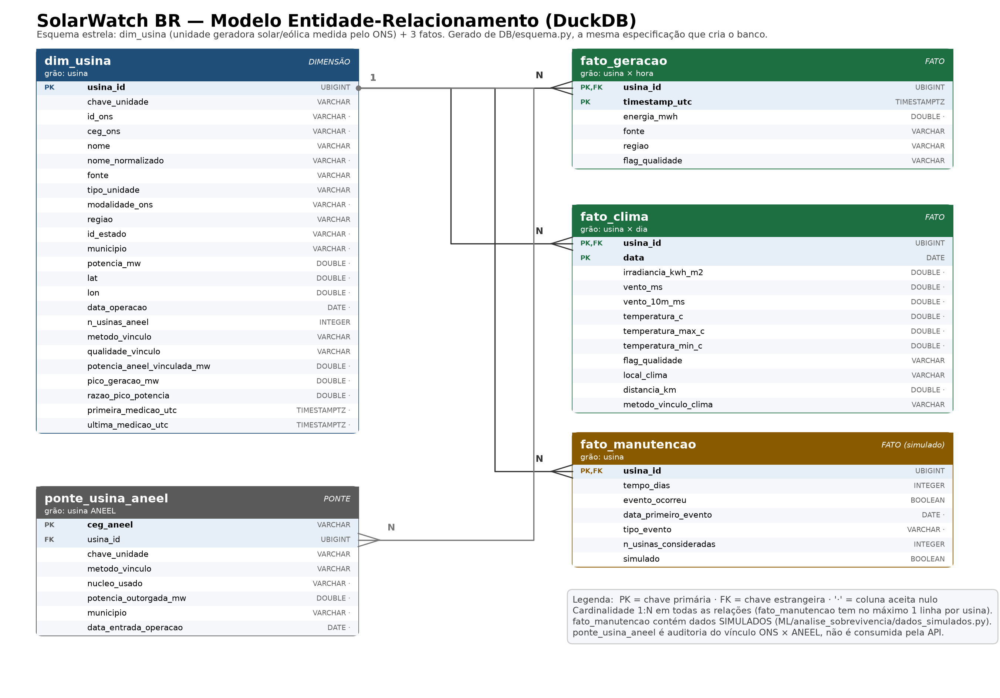

# Documentação Técnica — Banco de Dados (DuckDB)

> Escopo: tudo sobre a pasta `DB/` — o modelo físico do banco estático do SolarWatch BR, como ele é criado a partir da camada curated, o MER, as restrições, os índices, as views, o desempenho medido e as limitações.
>
> Documentos relacionados:
> - [`docs/ETL/doc_tecnica_etl.md`](../ETL/doc_tecnica_etl.md): como as tabelas curated são construídas e o que cada coluna significa.
> - [`docs/ingestao/doc_tecnica_ingestao.md`](../ingestao/doc_tecnica_ingestao.md) e [`doc_tecnica_dados_simulados.md`](../ingestao/doc_tecnica_dados_simulados.md): de onde vêm os dados.
> - `System design/system-design-solarwatch-api.md`: §4 (modelo de dados), §7 (tecnologia), §9 (consistência).

---

## Sumário

1. [Papel do banco na arquitetura](#1-papel-do-banco-na-arquitetura)
2. [Estrutura da pasta `DB/`](#2-estrutura-da-pasta-db)
3. [Como criar e regenerar](#3-como-criar-e-regenerar)
4. [Fonte única do esquema (`esquema.py`)](#4-fonte-única-do-esquema-esquemapy)
5. [MER](#5-mer)
6. [Tabelas e DDL](#6-tabelas-e-ddl)
7. [Restrições de integridade](#7-restrições-de-integridade)
8. [Índices](#8-índices)
9. [Views](#9-views)
10. [Processo de carga (`criar_banco.py`)](#10-processo-de-carga-criar_bancopy)
11. [Desempenho medido](#11-desempenho-medido)
12. [Tamanho, memória e deploy](#12-tamanho-memória-e-deploy)
13. [Consultas por endpoint da API](#13-consultas-por-endpoint-da-api)
14. [Diferenças em relação ao DDL do system design](#14-diferenças-em-relação-ao-ddl-do-system-design)
15. [Limitações e próximos passos](#15-limitações-e-próximos-passos)

---

## 1. Papel do banco na arquitetura

```
dados/limpos/curated/*.parquet  ──►  DB/criar_banco.py  ──►  DB/solarwatch.duckdb  ──►  API FastAPI (read-only)
```

O banco é **estático e read-only em runtime** (system design §2.4 e §9): a API só lê, e o único jeito de o dado mudar é rodar o ETL e recriar o arquivo. Isso elimina por construção race condition de escrita, migration com dado em produção e invalidação de cache.

Por que DuckDB (§7 do system design): é um banco embarcado em um único arquivo, colunar, sem servidor e sem custo. Ele roda dentro do mesmo processo da API no free tier do Render, lê Parquet nativamente e resolve agregações analíticas rápido.

| Característica | Valor |
|---|---|
| Arquivo | `DB/solarwatch.duckdb` (~46 MB) |
| Tabelas | 4 do modelo estrela + 1 ponte de auditoria |
| Linhas | ~601 mil no total |
| Período dos fatos | 01/07/2026 → 18/09/2026 |
| Escopo | Geração **solar e eólica** (o ETL mantém as demais fontes só na camada clean) |

---

## 2. Estrutura da pasta `DB/`

```
DB/
├── __init__.py
├── esquema.py            # fonte única: tabelas, colunas, tipos, chaves, índices e views
├── criar_banco.py        # cria o solarwatch.duckdb a partir da camada curated
├── mer.py                # desenha o MER em PNG a partir de esquema.py
├── mer_solarwatch.png    # diagrama gerado (versionado)
└── solarwatch.duckdb     # banco gerado (NÃO versionado — está no .gitignore)
```

O arquivo do banco fica fora do Git porque tem ~46 MB, é reconstruível em segundos e mudaria por inteiro a cada execução, inflando o histórico. O que se versiona é o **código que o produz**, junto com os Parquets da camada curated.

---

## 3. Como criar e regenerar

```bash
python -m ETL.pipeline          # (se necessário) atualiza a camada curated
python -m DB.criar_banco        # cria/atualiza DB/solarwatch.duckdb
python -m DB.mer                # redesenha DB/mer_solarwatch.png
```

Opções:

| Comando | Efeito |
|---|---|
| `python -m DB.criar_banco --saida /outro/caminho.duckdb` | Grava o banco em outro lugar (útil para testar sem tocar no atual) |
| `python -m DB.mer --dpi 300` | PNG em resolução maior (o padrão é 200 dpi) |
| `python -m DB.mer --saida docs/DB/mer.png` | Salva o diagrama em outro caminho |

A criação leva poucos segundos e é **idempotente**: o banco é sempre reconstruído do zero a partir dos Parquets. Se a camada curated não existir, o script falha com uma mensagem dizendo para rodar `python -m ETL.pipeline`.

---

## 4. Fonte única do esquema (`esquema.py`)

O risco clássico de um diagrama de banco é ele envelhecer e passar a mentir. Aqui, o **DDL executado** e o **MER desenhado** saem da mesma estrutura Python:

```python
TABELAS = {
    "fato_geracao": {
        "descricao": "Geração verificada pelo ONS",
        "origem": "fato_geracao.parquet",
        "grao": "usina × hora",
        "pk": ["usina_id", "timestamp_utc"],
        "fk": {"usina_id": ("dim_usina", "usina_id")},
        "colunas": [
            ("usina_id", "UBIGINT", True, "FK dim_usina"),
            ("timestamp_utc", "TIMESTAMPTZ", True, "Início da hora, em UTC"),
            ("energia_mwh", "DOUBLE", False, "Energia na hora; nula quando flag = faltante"),
            ...
        ],
    },
}
```

Cada coluna é `(nome, tipo DuckDB, obrigatória, descrição)`. A partir disso:

| Função | Gera |
|---|---|
| `ddl_tabela(nome)` | O `CREATE TABLE` completo, com `NOT NULL`, `PRIMARY KEY` e `FOREIGN KEY` |
| `select_de_parquet(nome, caminho)` | O `SELECT` de carga, com **cast explícito** de cada coluna na ordem do DDL |
| `mer.py` | O diagrama, lendo as mesmas colunas, chaves e grãos |

O cast explícito é o que protege contra mudança silenciosa de tipo no Parquet. Por exemplo, `fato_clima.usina_id` chega como `int64` do pandas e entra como `UBIGINT`, igual à chave da dimensão. Se uma coluna sumir ou trocar de tipo de forma incompatível, a carga falha **na hora**, em vez de gerar um banco sutilmente errado.

`INDICES` e `VIEWS` também moram nesse arquivo.

---

## 5. MER



O diagrama ([`DB/mer_solarwatch.png`](../../DB/mer_solarwatch.png)) é desenhado por `DB/mer.py` com matplotlib, sem depender de Graphviz ou de ferramenta externa, e mostra:

- as 5 tabelas com **todas** as colunas e seus tipos;
- `PK`, `FK` e `PK,FK` marcados em cada coluna, com as chaves em negrito;
- o sufixo `·` no tipo quando a coluna aceita nulo;
- o **grão** de cada tabela no cabeçalho;
- as relações **1:N** com pé-de-galinha do lado N;
- cores por papel: dimensão (azul), fatos (verde), fato simulado (âmbar) e ponte de auditoria (cinza).

Para mudar o layout, edite `POSICOES` em `mer.py`. Para mudar o conteúdo, edite `esquema.py` — o desenho acompanha.

---

## 6. Tabelas e DDL

A semântica de cada coluna está na [documentação do ETL](../ETL/doc_tecnica_etl.md#8-curated-layer-curated). Aqui está o modelo **físico**.

### 6.1 `dim_usina` — 308 linhas

Grão: **unidade geradora solar/eólica medida pelo ONS** (usina individual, conjunto de usinas ou agregado estadual de pequenas usinas). É o único nível em que existe geração medida, e a razão dessa escolha está no [ETL §8.2.1](../ETL/doc_tecnica_etl.md#821-a-decisão-de-grão).

```sql
CREATE TABLE dim_usina (
    usina_id UBIGINT NOT NULL,
    chave_unidade VARCHAR NOT NULL,
    id_ons VARCHAR,
    ceg_ons VARCHAR,
    nome VARCHAR NOT NULL,
    nome_normalizado VARCHAR,
    fonte VARCHAR NOT NULL,                    -- solar | eolica
    tipo_unidade VARCHAR NOT NULL,             -- usina | conjunto | pequenas_usinas
    modalidade_ons VARCHAR,
    regiao VARCHAR NOT NULL,                   -- N | NE | SE | S
    id_estado VARCHAR,
    municipio VARCHAR,
    potencia_mw DOUBLE,                        -- nula se o vínculo ONS×ANEEL não é confiável
    lat DOUBLE,
    lon DOUBLE,
    data_operacao DATE,
    n_usinas_aneel INTEGER NOT NULL,
    metodo_vinculo VARCHAR NOT NULL,           -- ceg | nome | sem_vinculo
    qualidade_vinculo VARCHAR NOT NULL,        -- exata | consistente | inconsistente | sem_vinculo
    potencia_aneel_vinculada_mw DOUBLE,
    pico_geracao_mw DOUBLE,
    razao_pico_potencia DOUBLE,
    primeira_medicao_utc TIMESTAMPTZ,
    ultima_medicao_utc TIMESTAMPTZ,
    PRIMARY KEY (usina_id)
);
```

Distribuição da qualidade do vínculo com a ANEEL, que determina quando `potencia_mw` é publicada:

| `qualidade_vinculo` | Unidades | Potência publicada |
|---|---|---|
| `consistente` | 78 | 19,4 GW |
| `exata` | 18 | 0,9 GW |
| `inconsistente` | 66 | — (nula) |
| `sem_vinculo` | 146 | — (nula) |

> Quem consome deve filtrar por `potencia_mw IS NOT NULL` (ou por `qualidade_vinculo`) em qualquer cálculo que dependa de potência, como fator de capacidade.

### 6.2 `fato_geracao` — 575.904 linhas

```sql
CREATE TABLE fato_geracao (
    usina_id UBIGINT NOT NULL,
    timestamp_utc TIMESTAMPTZ NOT NULL,
    energia_mwh DOUBLE,
    fonte VARCHAR NOT NULL,
    regiao VARCHAR NOT NULL,
    flag_qualidade VARCHAR NOT NULL,
    PRIMARY KEY (usina_id, timestamp_utc),
    FOREIGN KEY (usina_id) REFERENCES dim_usina(usina_id)
);
```

- `timestamp_utc` é `TIMESTAMPTZ`: o instante carrega o fuso. O DuckDB converte na leitura conforme o fuso da sessão, e a conversão para horário de Brasília é `timestamp_utc AT TIME ZONE 'America/Sao_Paulo'`.
- `energia_mwh` **aceita nulo**, sempre acompanhado de `flag_qualidade = 'faltante'` (96 horas). A linha permanece na tabela para o buraco ficar visível.
- `fonte` e `regiao` são desnormalizadas da dimensão, o que evita um join nas agregações nacionais.

### 6.3 `fato_clima` — 23.840 linhas

```sql
CREATE TABLE fato_clima (
    usina_id UBIGINT NOT NULL,
    data DATE NOT NULL,
    irradiancia_kwh_m2 DOUBLE,
    vento_ms DOUBLE,                -- a 50 m
    vento_10m_ms DOUBLE,
    temperatura_c DOUBLE,
    temperatura_max_c DOUBLE,
    temperatura_min_c DOUBLE,
    flag_qualidade VARCHAR NOT NULL,
    local_clima VARCHAR NOT NULL,
    distancia_km DOUBLE,
    metodo_vinculo_clima VARCHAR NOT NULL,
    PRIMARY KEY (usina_id, data),
    FOREIGN KEY (usina_id) REFERENCES dim_usina(usina_id)
);
```

O clima vem de **10 pontos da NASA POWER**, não da coordenada exata de cada usina. `local_clima`, `distancia_km` e `metodo_vinculo_clima` deixam a aproximação explícita, e a distância mediana é de 100 km. Dez unidades do subsistema Norte ficam sem clima, porque não há ponto de coleta lá.

### 6.4 `fato_manutencao` — 159 linhas (**dado simulado**)

```sql
CREATE TABLE fato_manutencao (
    usina_id UBIGINT NOT NULL,
    tempo_dias INTEGER NOT NULL,
    evento_ocorreu BOOLEAN NOT NULL,
    data_primeiro_evento DATE,
    tipo_evento VARCHAR,
    n_usinas_consideradas INTEGER NOT NULL,
    simulado BOOLEAN NOT NULL,
    PRIMARY KEY (usina_id),
    FOREIGN KEY (usina_id) REFERENCES dim_usina(usina_id)
);
```

Formato padrão de análise de sobrevivência: `tempo_dias` é o tempo até o evento **ou** até a censura, e `evento_ocorreu` distingue os dois casos (134 eventos e 25 censuras). A coluna `simulado`, sempre `true`, existe para que a API consiga avisar no payload que o dado é sintético.

### 6.5 `ponte_usina_aneel` — 790 linhas

```sql
CREATE TABLE ponte_usina_aneel (
    ceg_aneel VARCHAR NOT NULL,
    usina_id UBIGINT NOT NULL,
    chave_unidade VARCHAR NOT NULL,
    metodo_vinculo VARCHAR NOT NULL,
    nucleo_usado VARCHAR,
    potencia_outorgada_mw DOUBLE,
    municipio VARCHAR,
    data_entrada_operacao DATE,
    PRIMARY KEY (ceg_aneel),
    FOREIGN KEY (usina_id) REFERENCES dim_usina(usina_id)
);
```

Não faz parte do modelo servido pela API. Serve para **auditar** o vínculo ONS × ANEEL: quais usinas do cadastro entraram em cada unidade e por qual trecho de nome (`nucleo_usado`). Útil para investigar um `qualidade_vinculo = 'inconsistente'`.

---

## 7. Restrições de integridade

| Restrição | Onde | O que garante |
|---|---|---|
| `PRIMARY KEY` | 5 tabelas | Não existe usina repetida, nem duas medições da mesma usina no mesmo instante/dia |
| `FOREIGN KEY` | 3 fatos + ponte → `dim_usina` | Nenhum fato órfão: todo `usina_id` existe na dimensão |
| `NOT NULL` | Colunas marcadas como obrigatórias | Campos de identificação e classificação nunca faltam |

Testado no banco gerado:

```
INSERT INTO fato_manutencao VALUES (999999, ...)
→ ConstraintException: Violates foreign key constraint because key "usina_id: 999999" ...

INSERT INTO dim_usina (usina_id, ...) VALUES (1, ...)
→ ConstraintException: Duplicate key "usina_id: 1" violates primary key constraint.
```

Isso é **defesa em profundidade**: a mesma integridade já é checada pelo `ETL/validacao.py` antes de gravar a camada curated. A diferença é que aqui a garantia é do próprio banco, e vale também para quem carregar dados por fora da pipeline.

---

## 8. Índices

Declarados em `esquema.INDICES`, seguindo os padrões de acesso do system design §4.4:

| Índice | Tabela | Colunas | Query que serve |
|---|---|---|---|
| `idx_dim_usina_fonte_regiao` | `dim_usina` | `fonte`, `regiao` | `GET /usinas?fonte=solar&regiao=NE` |
| `idx_fato_geracao_timestamp` | `fato_geracao` | `timestamp_utc` | `GET /geracao/nacional` (janela de tempo, todas as usinas) |
| `idx_fato_clima_data` | `fato_clima` | `data` | Recortes por período no clima |

As chaves primárias já criam seus próprios índices, que é o que atende `GET /usinas/{id}/geracao`.

**Custo medido** (mesmo banco, com e sem os três índices):

| | Sem índices | Com índices |
|---|---|---|
| Tamanho do arquivo | 38,5 MB | 46,0 MB |
| Consulta "1 usina + 30 dias" | 3,3 ms | 1,8 ms |

Os 7,5 MB extras se pagam, e o system design já dizia que, em um banco colunar desse tamanho, índice importa menos do que em um Postgres — eles estão ali mais por disciplina de design do que por necessidade.

---

## 9. Views

| View | O que entrega |
|---|---|
| `vw_geracao_diaria` | Geração diária por usina, com o dia em **horário de Brasília** e a contagem de horas válidas |
| `vw_geracao_nacional_hora` | Geração por hora, fonte e subsistema, com o número de usinas |
| `vw_fator_capacidade_diario` | Fator de capacidade diário, já cruzado com o clima |

A terceira é a que costura as três fontes do projeto:

```sql
CREATE VIEW vw_fator_capacidade_diario AS
SELECT g.usina_id, g.dia, u.fonte, u.regiao, g.energia_mwh, u.potencia_mw,
       g.energia_mwh / (u.potencia_mw * 24) AS fator_capacidade,
       c.irradiancia_kwh_m2, c.vento_ms, c.temperatura_c
FROM vw_geracao_diaria g
JOIN dim_usina u USING (usina_id)
LEFT JOIN fato_clima c ON c.usina_id = g.usina_id AND c.data = g.dia
WHERE u.potencia_mw IS NOT NULL AND g.horas_validas = 24;
```

Ela já aplica as duas salvaguardas do projeto: só usinas com **potência confiável** e só dias **completos** (24 horas válidas). Resultado: 7.506 linhas, com fator de capacidade médio de **0,333** nas eólicas e **0,182** nas solares — valores coerentes com o parque brasileiro, o que é um bom teste de fumaça de que geração e potência estão casando.

---

## 10. Processo de carga (`criar_banco.py`)

```
_conferir_origens()          # os 5 Parquets da curated existem?
  └─ falta algum → FileNotFoundError dizendo para rodar o ETL
para cada tabela (dimensão primeiro, por causa das FKs):
  ├─ CREATE TABLE  (esquema.ddl_tabela)
  ├─ INSERT INTO ... SELECT com cast explícito FROM read_parquet(...)
  └─ log com a contagem de linhas e o grão
CREATE INDEX  ×3
CREATE VIEW   ×3
CHECKPOINT                   # descarrega o WAL no arquivo
os.replace(temporario, saida) # troca atômica
resumo()                     # consultas de fumaça em modo read-only
```

Dois pontos importantes:

- **Build-then-swap** (§9 e §13.3 do system design): o banco é construído em `solarwatch.duckdb.tmp` e só então substitui o arquivo definitivo, em uma operação atômica. Uma falha no meio da carga deixa o banco anterior intacto, e a API nunca lê um arquivo parcial. É o equivalente, no mundo de arquivo único, a uma migration sem downtime.
- **Ordem de criação:** a dimensão vem primeiro, porque as chaves estrangeiras das fatos a referenciam. Como `TABELAS` é um dicionário Python e a ordem de inserção é preservada, basta manter `dim_usina` no topo do arquivo.

O `resumo()` roda logo depois, em modo **read-only**, as consultas que a API vai fazer: contagem por fonte, período coberto, geração total, fator de capacidade médio, eventos de manutenção e uma série de 7 dias de uma usina. É uma verificação barata de que o banco não só foi criado, mas responde corretamente.

---

## 11. Desempenho medido

Melhor de 5 execuções, no banco completo, em máquina local:

| Consulta | Tempo | Endpoint correspondente |
|---|---|---|
| Lista de usinas filtrada por fonte e região | **0,6 ms** | `GET /usinas?fonte=solar&regiao=NE` |
| Série horária de 30 dias de uma usina | **2,7 ms** | `GET /usinas/{id}/geracao` |
| Tempo até evento de todas as usinas | **0,3 ms** | `GET /usinas/{id}/sobrevivencia` |
| Geração diária nacional por fonte (base inteira) | **31 ms** | `GET /geracao/nacional` |
| Fator de capacidade médio por usina (view) | **44 ms** | painel do frontend |
| Join geração diária × clima | **44 ms** | análises e features de ML |

O orçamento do system design é de **50 ms (p50) por endpoint crítico** (§2.2). As consultas por usina ficam com duas ordens de grandeza de folga. Já as **agregações que varrem a base inteira** (31–44 ms) ficam no limite do orçamento em uma máquina local, e no free tier do Render, com CPU compartilhada, devem ficar acima dele.

Encaminhamento sugerido: restringir a janela padrão de `/geracao/nacional`, ou materializar a agregação diária como tabela em vez de view (o volume é pequeno). Isso está na [§15](#15-limitações-e-próximos-passos).

---

## 12. Tamanho, memória e deploy

| Item | Valor |
|---|---|
| Arquivo do banco | ~46 MB (38,5 MB sem os índices) |
| Parquets de origem | ~2,4 MB |
| Memória do free tier do Render | 512 MB |

O arquivo é maior que os Parquets porque guarda, além dos dados, as estruturas de índice das chaves primárias e estrangeiras (ART) e os metadados do próprio formato. Ainda assim, o DuckDB **não carrega o arquivo inteiro na memória**: ele lê as páginas necessárias, então o consumo real da API fica bem abaixo do tamanho do arquivo.

**Versionamento:** `DB/*.duckdb` está no `.gitignore`, junto com os temporários `.duckdb.tmp` e `.duckdb.wal`. O system design previa versionar o `.duckdb`, mas o arquivo real ficou em 46 MB e mudaria por inteiro a cada execução, o que inflaria o histórico rapidamente. Como ele é reconstruível em segundos a partir dos Parquets versionados, o que se guarda é o código e a camada curated. Se o deploy no Render precisar do arquivo pronto no repositório, a decisão pode ser revista — o limite de tamanho do GitHub (100 MB por arquivo) ainda comporta.

---

## 13. Consultas por endpoint da API

```sql
-- GET /usinas?fonte=solar&regiao=NE
SELECT usina_id, nome, fonte, regiao, municipio, potencia_mw, lat, lon, data_operacao
FROM dim_usina
WHERE fonte = 'solar' AND regiao = 'NE'
ORDER BY nome;

-- GET /usinas/{id}/geracao?inicio=...&fim=...
SELECT timestamp_utc, energia_mwh, flag_qualidade
FROM fato_geracao
WHERE usina_id = ? AND timestamp_utc BETWEEN ? AND ?
ORDER BY timestamp_utc;

-- GET /geracao/nacional?granularidade=dia
SELECT CAST(timestamp_utc AT TIME ZONE 'America/Sao_Paulo' AS DATE) AS dia,
       fonte, SUM(energia_mwh) AS energia_mwh
FROM fato_geracao
WHERE timestamp_utc BETWEEN ? AND ?
GROUP BY ALL
ORDER BY dia, fonte;

-- GET /usinas/{id}/clima
SELECT data, irradiancia_kwh_m2, vento_ms, temperatura_c, flag_qualidade,
       local_clima, distancia_km, metodo_vinculo_clima
FROM fato_clima
WHERE usina_id = ? ORDER BY data;

-- GET /usinas/{id}/sobrevivencia
SELECT tempo_dias, evento_ocorreu, data_primeiro_evento, tipo_evento, simulado
FROM fato_manutencao
WHERE usina_id = ?;

-- Auditoria do vínculo de uma unidade
SELECT ceg_aneel, metodo_vinculo, nucleo_usado, potencia_outorgada_mw, municipio
FROM ponte_usina_aneel
WHERE usina_id = ?;
```

Abrir o banco em Python (a API deve usar `read_only=True`):

```python
import duckdb
con = duckdb.connect("DB/solarwatch.duckdb", read_only=True)
usinas = con.execute(
    "SELECT usina_id, nome FROM dim_usina WHERE fonte = ? AND potencia_mw IS NOT NULL", ["solar"]
).fetchall()
```

O modo read-only permite **várias conexões simultâneas** ao mesmo arquivo e evita qualquer escrita acidental em produção.

---

## 14. Diferenças em relação ao DDL do system design

O DDL do §4.2 foi escrito antes de os dados existirem. As diferenças, todas herdadas da camada curated, estão detalhadas no [ETL §12](../ETL/doc_tecnica_etl.md#12-diferenças-em-relação-ao-ddl-do-system-design). Resumo:

| Item | System design | Implementado | Motivo |
|---|---|---|---|
| Nome do tempo | `timestamp` | `timestamp_utc` (`TIMESTAMPTZ`) | Fuso explícito no nome e no tipo |
| `energia_mwh` | `NOT NULL` | Aceita nulo, com `flag_qualidade` | Buraco de dado fica visível em vez de virar linha ausente |
| `fato_clima.vento_ms` | vento genérico | Vento a **50 m** (+ 10 m) | Altura mais representativa para eólica |
| `dim_usina` | 9 colunas | 24 colunas | Colunas de auditoria do vínculo e de cobertura da série |
| `dim_usina.potencia_mw` | sempre preenchida | Nula quando o vínculo não é confiável | Não publicar potência errada |
| Tabelas | 4 | 5 (+ `ponte_usina_aneel`) | Auditoria do cruzamento ONS × ANEEL |
| Grão de "usina" | usina | Unidade geradora do ONS | Único grão com geração medida |
| Volume estimado | ~1.000 registros | ~601.000 registros | A estimativa do design era para as tabelas de consulta; o dado horário real é bem maior |

O último item merece atenção: o dimensionamento do system design (§3.3) partia de ~1.000 registros e ~200 KB de dado quente. A realidade é 576 mil linhas de geração e um banco de 46 MB. Continua pequeno para o free tier, mas as estimativas de memória e latência de lá estão desatualizadas em duas ordens de grandeza.

---

## 15. Limitações e próximos passos

| # | Limitação | Impacto | Próximo passo |
|---|---|---|---|
| 1 | A criação do banco não faz parte da `ETL.pipeline` | É preciso lembrar de rodar `python -m DB.criar_banco` depois do ETL | Adicionar uma etapa `load` na pipeline (`--etapas raw clean curated load`) |
| 2 | Agregações que varrem a base inteira levam 31–44 ms | No free tier, acima do orçamento de 50 ms | Materializar a agregação diária como tabela, ou limitar a janela padrão do endpoint nacional |
| 3 | Banco fora do Git | O deploy precisa gerar o arquivo | Gerar no build do Render, ou versionar via Git LFS se for preciso o arquivo pronto |
| 4 | Sem testes automatizados do banco | Uma mudança no esquema pode quebrar a carga em silêncio | `pytest`: criar o banco em arquivo temporário, conferir contagens, PKs, FKs e o resultado das views |
| 5 | Sem histórico: cada carga substitui tudo | Não dá para comparar versões do dado | Se necessário, gravar `data_carga` nas tabelas ou guardar bancos datados |
| 6 | Metadados de proveniência não ficam no banco | O banco não sabe de qual coleta ele veio | Tabela `meta_carga` com data da carga, partição raw de origem e contagens |
| 7 | 146 unidades sem potência e 10 sem clima | Endpoints devolvem campos nulos para elas | Melhorar o vínculo no ETL ([ETL §15](../ETL/doc_tecnica_etl.md#15-limitações-conhecidas-e-próximos-passos)) |

---

*Documento gerado em 19/09/2026 a partir do código de `DB/` e do banco criado com a camada curated de 18/09/2026.*
