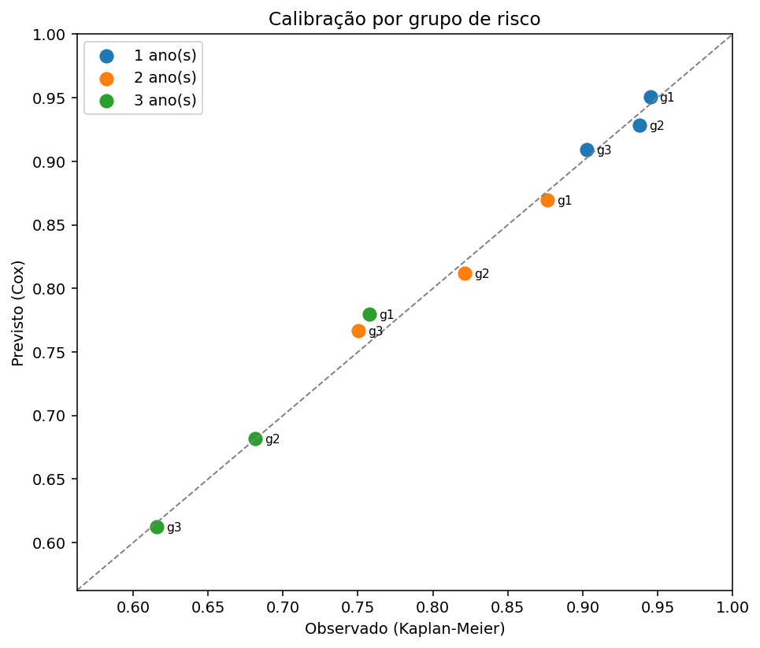

# Documentação Técnica — Análise de Sobrevivência de Ativos

> Escopo: tudo sobre `ML/analise_sobrevivencia/` — Kaplan-Meier por fonte, ajuste paramétrico, Cox de riscos proporcionais, a saída de produto (probabilidade de a usina passar N meses sem manutenção), a avaliação do modelo e os artefatos salvos em `ML/modelos/`.
>
> ⚠️ **Os eventos de manutenção são SINTÉTICOS.** As usinas, potências, regiões e datas são reais (cadastro ANEEL), mas nenhuma falha aconteceu de verdade. Nada aqui diz respeito à confiabilidade real de usinas, fabricantes ou regiões. A geração desses dados está em [`doc_tecnica_dados_simulados.md`](../ingestao/doc_tecnica_dados_simulados.md).
>
> Documentos relacionados: [ETL](../ETL/doc_tecnica_etl.md) (como a `dim_usina` é construída), [banco](../DB/doc_tecnica_db.md) (de onde vêm as usinas da predição), [séries temporais](doc_tecnica_series_temporais.md) (o outro modelo do projeto).

---

## Sumário

1. [Objetivo](#1-objetivo)
2. [Estrutura da pasta](#2-estrutura-da-pasta)
3. [Como executar](#3-como-executar)
4. [Dados e covariáveis](#4-dados-e-covariáveis)
5. [Kaplan-Meier por fonte](#5-kaplan-meier-por-fonte)
6. [Ajuste paramétrico](#6-ajuste-paramétrico)
7. [Cox de riscos proporcionais](#7-cox-de-riscos-proporcionais)
8. [Avaliação](#8-avaliação)
9. [Saída de produto: probabilidade por usina](#9-saída-de-produto-probabilidade-por-usina)
10. [O bug da extrapolação e como foi resolvido](#10-o-bug-da-extrapolação-e-como-foi-resolvido)
11. [Artefatos salvos](#11-artefatos-salvos)
12. [Como usar o modelo salvo](#12-como-usar-o-modelo-salvo)
13. [Decisões metodológicas](#13-decisões-metodológicas)
14. [Eventos recorrentes: Andersen-Gill e PWP](#14-eventos-recorrentes-andersen-gill-e-pwp)
15. [Limitações e próximos passos](#15-limitações-e-próximos-passos)

---

## 1. Objetivo

Responder, por usina: **qual a probabilidade de passar os próximos N meses sem precisar de manutenção corretiva?**

Isso alimenta o endpoint `/usinas/{id}/sobrevivencia` (system design §5) e um card do frontend. O caminho até lá tem três etapas, cada uma respondendo a uma pergunta diferente:

| Etapa | Pergunta | Método |
|---|---|---|
| Descrever | Como o tempo até manutenção se distribui em solar e eólica? | **Kaplan-Meier** + log-rank |
| Modelar a forma | Qual família descreve melhor esse tempo? O risco cresce com a idade? | **Weibull / Log-Normal / Log-Logística / Exponencial**, comparadas por AIC |
| Explicar e prever | Que fatores aceleram a manutenção, e qual a probabilidade por usina? | **Cox** estratificado + sobrevivência condicional |

O dado tem **censura à direita**: 45% das usinas terminaram o período de observação sem evento. Só se sabe que elas passaram de um certo tempo. Métodos de sobrevivência existem exatamente para usar essa informação parcial, em vez de descartá-la ou tratá-la como "não falhou nunca".

---

## 2. Estrutura da pasta

```
ML/analise_sobrevivencia/
├── __init__.py
├── dados_simulados.py   # gerador dos eventos (documentado à parte)
├── config.py            # covariáveis, horizontes, centralizações, k-folds
├── dados.py             # carga do treino (simulado) e das usinas da predição (dim_usina)
├── modelos.py           # KM, paramétricos, Cox, Weibull de regressão e o Previsor
├── recorrentes.py       # Andersen-Gill, PWP (tempo total e gap time), MCF
├── avaliacao.py         # C-index k-fold, Schoenfeld, recuperação dos betas, calibração
├── treinar.py           # 1º evento: orquestra tudo, salva pickles e tabelas
├── treinar_recorrentes.py  # eventos recorrentes: AG, PWP, MCF e manutenções esperadas
└── resultados/          # kaplan_meier_por_fonte.png, calibracao.png, probabilidades_12m.png, mcf_recorrentes.png
```

---

## 3. Como executar

```bash
python -m ML.analise_sobrevivencia.dados_simulados    # (se ainda não existir) gera os eventos
python -m ML.analise_sobrevivencia.treinar            # ~20 s
python -m ML.analise_sobrevivencia.treinar --horizontes 3 6 12
python -m ML.analise_sobrevivencia.treinar --sem-graficos --sem-salvar

python -m ML.analise_sobrevivencia.treinar_recorrentes   # eventos recorrentes (§15)
```

| Argumento | Padrão | Efeito |
|---|---|---|
| `--horizontes` | `6 12 24 36` | Horizontes em meses das probabilidades |
| `--sem-graficos` | — | Não gera os PNG |
| `--sem-salvar` | — | Não grava pickle nem Parquet |

---

## 4. Dados e covariáveis

### 4.1 Base de treino

`dados/simulados/eventos_manutencao_simulados.parquet`: **1.854 usinas** da ANEEL (solar e eólica, em operação, ≥ 1 MW), com:

- `tempo_anos`: tempo até o primeiro evento **ou** até o fim da observação;
- `evento`: 1 = manutenção observada (**916**), 0 = censura (**938**, 51%).

A carga passa por `ds_toolkit.preparar_sobrevivencia`, que valida os invariantes: tempo positivo, evento em {0,1} e consistência entre evento e data.

### 4.2 Covariáveis

| Covariável | Definição | Centralização |
|---|---|---|
| `log_potencia_mw_c` | ln(MW) − ln(30) | Usina de 30 MW (mediana do parque) |
| `subsistema_NE`, `subsistema_S`, `subsistema_N` | Indicadores | Referência: **SE** |
| `ano_entrada_c` | ano de operação − 2018 | Coorte de 2018 |
| `fonte` | solar / eólica | **Estrato**, não covariável (ver [§7.1](#71-por-que-estratificar-por-fonte)) |

As centralizações são **idênticas às do gerador**, o que permite comparar diretamente os coeficientes estimados com os verdadeiros ([§8.3](#83-recuperação-dos-parâmetros-verdadeiros)).

### 4.3 Sobre a covariável "idade"

O escopo pedia "idade da usina" entre as covariáveis. Mas a idade **no momento do evento** é o próprio tempo de sobrevivência: usá-la como covariável seria circular (prever o tempo com o tempo).

O que entra no modelo é o **ano de entrada em operação**, que é a *coorte tecnológica* da usina — captura "usinas mais novas têm equipamento melhor". A idade atual aparece em outro papel, igualmente importante: na **sobrevivência condicional** da predição ([§9.1](#91-probabilidade-condicional-à-idade)).

### 4.4 Base de predição

Da `dim_usina` do banco, as unidades com potência confiável e data de operação: **93 usinas** (51 eólicas e 42 solares). As demais ficam de fora porque o vínculo ONS × ANEEL não permitiu determinar potência ou data ([ETL §8.2.4](../ETL/doc_tecnica_etl.md#824-verificação-do-vínculo-contra-a-geração-medida)).

---

## 5. Kaplan-Meier por fonte

Estimador não paramétrico da curva de sobrevivência, via `ds_toolkit.kaplan_meier`, com tabela de risco e teste de log-rank.


| Fonte | n | Eventos | Mediana | IC 95% |
|---|---|---|---|---|
| eólica | 1.123 | 733 | **4,26 anos** | 3,97 – 4,65 |
| solar | 731 | 183 | **6,56 anos** | 5,43 – 8,23 |

**Log-rank: p = 3,0 × 10⁻¹⁰** — as curvas diferem de forma clara.

Como ler o gráfico:

- A curva eólica cai mais rápido, o que é coerente com o parque eólico ter mais componentes mecânicos sob fadiga.
- Os **ticks verticais** são censuras: usinas que saíram da observação sem evento.
- A faixa é o IC 95%. Ela **alarga muito no fim** da curva solar porque restam poucas usinas em risco (a tabela abaixo do gráfico mostra: aos 8 anos, 11 usinas solares; aos 10 anos, 3). Conclusões sobre a cauda são frágeis.

---

## 6. Ajuste paramétrico

Quatro famílias ajustadas por fonte e comparadas por AIC (menor = melhor equilíbrio entre ajuste e complexidade):

| Fonte | Modelo | AIC | ΔAIC | Parâmetros | Mediana prevista |
|---|---|---|---|---|---|
| eólica | **loglogistico** | 4.038,7 | 0,0 | α=4,16 β=**1,75** | 4,16 anos |
| eólica | weibull | 4.038,8 | 0,1 | λ=5,89 ρ=**1,32** | 4,54 |
| eólica | lognormal | 4.072,0 | 33,3 | μ=1,41 σ=1,03 | 4,10 |
| eólica | exponencial | 4.114,7 | 76,1 | λ=6,08 | 4,22 |
| solar | **loglogistico** | 1.231,1 | 0,0 | α=6,69 β=**1,51** | 6,69 anos |
| solar | weibull | 1.232,2 | 1,2 | λ=8,65 ρ=**1,32** | 6,67 |
| solar | lognormal | 1.248,7 | 17,6 | μ=2,03 σ=1,32 | 7,65 |
| solar | exponencial | 1.250,1 | 19,0 | λ=11,13 | 7,72 |

**A log-logística passou a vencer nas duas fontes** — e isso *não* é um acidente. Os dados são gerados por uma Weibull, mas com **fragilidade gama por usina** ([doc dos dados simulados §5.1](../ingestao/doc_tecnica_dados_simulados.md#51-fragilidade-frailty-gama-por-usina)). A mistura de Weibulls por um fator gama é justamente o que produz uma cauda mais pesada e um risco que cresce e depois desacelera — a forma característica da log-logística.

A diferença é mínima (ΔAIC de 0,1 na eólica e 1,2 na solar), ou seja, **as duas famílias descrevem os dados igualmente bem**; o que importa é o que a inversão de ranking revela. Antes da fragilidade, a Weibull vencia com folga (ΔAIC de 67 para a segunda). A heterogeneidade não observada deixa marca na forma da distribuição agregada, e é exatamente esse tipo de pista que, num dado real, deveria levantar a suspeita de que falta uma variável.

Interpretação do parâmetro de forma da Weibull (ρ): **1,32 nas duas fontes, > 1**, ou seja, **risco crescente com a idade** — desgaste, não mortalidade infantil. A exponencial (risco constante) continua sendo a pior colocada.

> O ρ estimado (1,32 nas duas) fica **abaixo** dos valores do gerador (1,6 na eólica, 1,3 na solar), o que também é efeito da fragilidade: a mistura achata o risco agregado, porque as usinas frágeis falham cedo e sobram as robustas. É o mesmo mecanismo que atenua os coeficientes do Cox ([§7.2](#72-coeficientes)).

---

## 7. Cox de riscos proporcionais

### 7.1 Por que estratificar por fonte

O modelo de Cox supõe que o efeito de cada covariável **multiplica** o risco por um fator constante no tempo. Solar e eólica têm linhas de base Weibull **com formas diferentes** (1,3 e 1,6), então a razão entre os riscos das duas muda ao longo do tempo — a premissa não vale entre fontes.

Solução: `fonte` entra como **estrato**, não como covariável. Cada fonte tem sua própria linha de base não paramétrica, e os coeficientes das covariáveis são compartilhados e comparáveis.

```python
CoxPHFitter().fit(dados, duration_col="tempo_anos", event_col="evento", strata=["fonte"])
```

### 7.2 Coeficientes

| Covariável | coef | Hazard ratio | IC 95% (coef) | p |
|---|---|---|---|---|
| `log_potencia_mw_c` | **0,159** | **1,17** | 0,055 – 0,262 | 0,003 |
| `ano_entrada_c` | **−0,040** | **0,96** | −0,059 – −0,020 | 0,0001 |
| `subsistema_N` | 0,511 | 1,67 | −0,061 – 1,084 | 0,08 |
| `subsistema_NE` | 0,238 | 1,27 | −0,066 – 0,543 | 0,12 |
| `subsistema_S` | 0,015 | 1,02 | −0,369 – 0,399 | 0,94 |

Leitura prática:

- **Potência:** cada unidade de ln(MW) aumenta o risco em 17%. Dobrar a potência (ln 2 = 0,69) multiplica o risco por 1,11, ou seja, **+11%**. Faz sentido: mais equipamento, mais pontos de falha.
- **Coorte:** cada ano mais nova reduz o risco em **4%**. Uma usina de 2024 tem ~21% menos risco que uma de 2018.
- **Região:** nenhum efeito significativo. Isso **não** quer dizer que região não importe — o intervalo é largo demais para concluir qualquer coisa. Ver [§8.3](#83-recuperação-dos-parâmetros-verdadeiros).

**Os coeficientes estão atenuados de propósito.** O gerador usa 0,20 para `log_potencia_mw_c` e o Cox devolve 0,159. Não é erro de ajuste: com **fragilidade** não observada, o modelo marginal tem coeficientes menores em módulo que o condicional — as usinas frágeis falham cedo e saem do conjunto de risco, e o que resta é uma população cada vez mais selecionada. Quem quiser o efeito condicional precisa modelar a fragilidade ([§14.7](#147-fragilidade-gama-por-usina)).

### 7.3 O Cox ingênuo e o limite do teste de premissa

O código também ajusta, para comparação, um Cox com `fonte` como covariável comum (`ajustar_cox_ingenuo`), onde a premissa é violada **por construção**. Resultado: HR de 1,32 para eólica, e o **teste de Schoenfeld não acusou nada** (p > 0,05 em todas as covariáveis).

Essa é uma lição que vale registrar: **"o teste passou" não prova que a premissa vale.** As duas formas Weibull (1,3 e 1,6) são próximas o bastante para o teste não ter poder de distinguir na janela observada. A estratificação aqui se justifica pelo que se sabe do processo gerador, não pelo resultado do teste. Com dado real, sem conhecer o gerador, o caminho seria olhar também os resíduos de Schoenfeld no tempo e as curvas log(−log S).

---

## 8. Avaliação

### 8.1 Discriminação (C-index)

| Métrica | Valor |
|---|---|
| C-index no treino | 0,545 |
| **C-index 5-fold (fora da amostra)** | **0,578 ± 0,023** |
| Folds | 0,594 · 0,576 · 0,581 · 0,534 · 0,548 |

O C-index mede se o modelo ordena corretamente quem falha antes (0,5 = aleatório; > 0,7 = bom). **0,578 é baixo**, e isso é esperado: no gerador, os efeitos das covariáveis são modestos e a maior parte da variação do tempo até falha é aleatória (a componente Weibull). Nenhum modelo poderia ir muito além disso nesses dados — o teto é imposto pelo processo, não pelo método.

O C-index fora da amostra ficou **acima** do de treino, o que é possível com efeitos fracos e é sinal de que não há overfitting (são 169 eventos por covariável, muito acima da regra prática de 10).

### 8.2 Premissa de riscos proporcionais (Schoenfeld)

| Covariável | Estatística | p |
|---|---|---|
| `log_potencia_mw_c` | 1,27 | 0,26 |
| `ano_entrada_c` | 0,51 | 0,47 |
| `subsistema_S` | 1,55 | 0,21 |
| `subsistema_N` | 0,004 | 0,95 |
| `subsistema_NE` | 0,003 | 0,96 |

Nenhuma violação detectada no modelo estratificado — o esperado, já que os efeitos das covariáveis são de fato proporcionais por construção. (A ressalva sobre o poder do teste continua valendo: veja [§7.3](#73-o-cox-ingênuo-e-o-limite-do-teste-de-premissa).)

### 8.3 Recuperação dos parâmetros verdadeiros

Por serem dados simulados, dá para perguntar o que nunca se pode perguntar com dado real: **o modelo recupera a verdade?**

| Covariável | Verdadeiro | Estimado | IC 95% | Dentro do IC |
|---|---|---|---|---|
| `log_potencia_mw_c` | 0,20 | 0,159 | 0,055 – 0,262 | ✅ |
| `ano_entrada_c` | −0,04 | −0,040 | −0,059 – −0,020 | ✅ |
| `subsistema_NE` | 0,25 | 0,238 | −0,066 – 0,543 | ✅ |
| `subsistema_S` | 0,10 | 0,015 | −0,369 – 0,399 | ✅ |
| `subsistema_N` | 0,15 | 0,511 | −0,061 – 1,084 | ✅ |

**Os 5 valores verdadeiros caem dentro dos ICs.** Duas ressalvas honestas:

- Os efeitos regionais têm ICs largos e estimativas pontuais distantes da verdade, porque 74% das usinas estão no Nordeste e só 24 estão no Norte. A geografia real do parque limita o que dá para estimar, e isso apareceria igual em dado real.
- `log_potencia_mw_c` é estimado **abaixo** do verdadeiro (0,159 contra 0,20). Com fragilidade não observada, o coeficiente marginal é atenuado por construção ([§7.2](#72-coeficientes)); "cair dentro do IC" aqui não é o mesmo que "sem viés".

### 8.4 Calibração

Discriminação responde "ordena certo?". Calibração responde "**o número está certo?**" — se o modelo diz 80%, acontece em 80% dos casos? Aqui, as usinas foram divididas em tercis de risco e, em cada tempo, a média das probabilidades previstas foi comparada com o Kaplan-Meier observado daquele grupo (que respeita a censura).

| Grupo de risco | n | 1 ano | 2 anos | 3 anos |
|---|---|---|---|---|
| g1 (menor risco) | 618 | 0,951 vs 0,945 | 0,870 vs 0,877 | 0,780 vs 0,758 |
| g2 | 619 | 0,928 vs 0,938 | 0,812 vs 0,821 | 0,682 vs 0,682 |
| g3 (maior risco) | 617 | 0,910 vs 0,903 | 0,767 vs 0,750 | 0,613 vs 0,616 |

*(previsto vs observado)*

**Erro absoluto médio de 0,012, máximo de 0,020.** O modelo está bem calibrado, e os grupos aparecem na ordem certa (g1 sobrevive mais que g3 em todos os tempos). Como a saída do produto é uma probabilidade exibida ao usuário, calibração importa mais que C-index.



---

## 9. Saída de produto: probabilidade por usina

### 9.1 Probabilidade condicional à idade

Uma usina que **já opera há 5 anos sem manutenção** não parte do zero. A probabilidade servida é condicional:

```math
P(\text{sobreviver mais } N \text{ meses} \mid \text{já sobreviveu } t_0) = \frac{S(t_0 + N)}{S(t_0)}
```

onde `t₀ = idade_anos` (hoje − data de operação) e `S` é a curva prevista pelo Cox para as covariáveis daquela usina. A coluna `condicional_na_idade` registra que foi assim que o número saiu.

### 9.2 Resultado

93 usinas, com horizontes de 6, 12, 24 e 36 meses:

| Fonte | Método | n | Idade mediana | P(12 meses) média | Risco relativo médio |
|---|---|---|---|---|---|
| eólica | cox | 29 | 4,9 anos | 0,77 | 1,46 |
| eólica | weibull | 22 | 12,7 anos | 0,69 | 1,77 |
| solar | cox | 34 | 3,4 anos | 0,86 | 1,20 |
| solar | weibull | 8 | 8,8 anos | 0,77 | 1,42 |

Distribuição geral das probabilidades:

| | 6 meses | 12 meses | 24 meses | 36 meses |
|---|---|---|---|---|
| média | 0,88 | 0,78 | 0,61 | 0,50 |
| mediana | 0,89 | 0,78 | 0,62 | 0,49 |
| mínimo | 0,72 | 0,51 | 0,26 | 0,13 |
| máximo | 0,98 | 0,93 | 0,86 | 0,78 |

O tempo mediano previsto até manutenção vai de 2,2 a 8,3 anos, com mediana de 4,0.

Duas observações sobre o efeito da fragilidade aqui. As probabilidades **subiram** em relação à versão sem ela (a média de 12 meses da eólica era 0,55): com variância 0,5, a usina mediana tem `Z = 0,84`, ou seja, é *menos* frágil que a média — a cauda de usinas problemáticas puxa o risco médio para cima, mas a maioria fica abaixo dele. E **nenhuma usina chega a 1,00** em nenhum horizonte, o que é o sintoma que a [§10](#10-o-bug-da-extrapolação-e-como-foi-resolvido) trata.

### 9.3 Colunas do arquivo

`ML/modelos/sobrevivencia_probabilidades_por_usina.parquet` (93 × 18), pronto para o endpoint e para o card:

| Coluna | Descrição |
|---|---|
| `usina_id`, `nome`, `fonte`, `id_subsistema`, `id_estado`, `municipio` | Identificação (vêm da `dim_usina`) |
| `potencia_mw`, `data_operacao`, `idade_anos` | Atributos usados no cálculo |
| `p_sem_manutencao_6m` … `_36m` | **A saída principal** |
| `risco_relativo` | exp(β·x): risco face à usina de referência |
| `tempo_mediano_anos` | Tempo mediano previsto até o evento |
| `condicional_na_idade` | Se a probabilidade é condicional (sempre `true` aqui) |
| `metodo_extrapolacao` | `cox` ou `weibull` ([§10](#10-o-bug-da-extrapolação-e-como-foi-resolvido)) |
| `qualidade_vinculo` | Qualidade do vínculo ONS × ANEEL da unidade |

---

## 10. O bug da extrapolação e como foi resolvido

**Sintoma:** na primeira versão, o `CONJUNTO EOLICO CAETITE NORTE`, com 11,96 anos de operação, saía com `p_sem_manutencao_12m = 1,00` — enquanto seu próprio tempo mediano previsto era de 2,6 anos. Absurdo na cara.

**Causa:** o Cox é **semiparamétrico**. Sua linha de base é estimada a partir dos eventos observados e, depois do **último evento** de cada estrato, ela fica **plana** — o modelo não tem informação ali. Para uma usina com idade além desse ponto, S(t₀) e S(t₀+N) caem na região plana, e a razão S(t₀+N)/S(t₀) vale exatamente 1.

Os limites medidos: **16,79 anos** na eólica e **8,95 anos** na solar.

**Correção:** dentro do suporte, o cálculo usa o Cox; **além dele, usa uma regressão Weibull** (`WeibullAFTFitter`, uma por fonte, com as mesmas covariáveis), que é paramétrica e continua decaindo de forma suave — o comportamento fisicamente esperado de um ativo que envelhece. A coluna `metodo_extrapolacao` marca qual foi usado.

**Efeito:** 30 das 93 usinas (22 eólicas e 8 solares, as mais antigas) usam a extrapolação Weibull. A Taíba, com 27,8 anos de operação, sairia com 1,00 pelo Cox e sai com **0,51** em 12 meses e **0,13** em 36.

Essa correção também aproveita o modelo paramétrico da [§6](#6-ajuste-paramétrico) no produto, e não só na comparação.

### 10.1 A reincidência: "último evento" não é suporte

Ao regerar os dados com fragilidade, o mesmo sintoma **voltou**: o `CONJUNTO EOLICO CAETITE NORTE`, agora com 11,99 anos, saía de novo com `1,00` em todos os horizontes — apesar da correção acima estar no lugar.

O motivo é sutil. O limite de suporte era o **último tempo com evento** do estrato, e com a fragilidade esse último evento foi para 16,79 anos na eólica. Como 11,99 < 16,79, a usina era considerada dentro do suporte e usava o Cox. Só que o conjunto de risco naquela faixa é minúsculo:

| Anos | 10 | 11 | 12 | 13 | 14 | 15 |
|---|---|---|---|---|---|---|
| Eólicas em risco | 55 | 21 | 6 | 3 | 2 | 1 |

Com 6 usinas em risco aos 12 anos e o evento seguinte só lá na frente, a linha de base fica **plana** de 11,99 a 14,99 — e `S(t₀+N)/S(t₀)` volta a valer exatamente 1. Um único evento isolado na cauda "estende" o suporte formalmente sem sustentar nada.

**Correção:** o limite passou a ser o último tempo com evento que ainda tenha **pelo menos 20 unidades em risco** (`MINIMO_EM_RISCO`). Os limites caíram de 16,79 para **11,00 anos** na eólica e de 8,95 para **8,28** na solar, e as usinas que usam Weibull passaram de 6 para 30. O Caetité Norte agora sai com **0,675** em 12 meses, e a probabilidade máxima entre as 93 usinas é 0,93 — nenhum 1,00 sobrou.

A lição: "há um evento depois deste tempo" é um critério de suporte fraco. O que sustenta uma linha de base não paramétrica é **massa de dados**, não a existência de uma observação.

---

## 11. Artefatos salvos

| Arquivo (`ML/modelos/`) | Tamanho | Conteúdo |
|---|---|---|
| `sobrevivencia_cox.pkl` | 559 KB | `PrevisorSobrevivencia`: Cox estratificado + Weibull por fonte + limites de suporte + horizontes |
| `sobrevivencia_cox.pkl.meta.json` | 1,2 KB | Metadados: C-index k-fold, betas verdadeiros, limites de suporte, aviso de dado simulado |
| `sobrevivencia_probabilidades_por_usina.parquet` | 21 KB | A tabela do produto (93 usinas) |
| `sobrevivencia_parametricos.parquet` | 6,3 KB | Ranking AIC por fonte |
| `sobrevivencia_diagnosticos.parquet` | 7,1 KB | Calibração + Schoenfeld |
| `sobrevivencia_recuperacao_betas.parquet` | 4,7 KB | Estimado × verdadeiro |

Gráficos em `ML/analise_sobrevivencia/resultados/`: `kaplan_meier_por_fonte.png`, `calibracao.png` e `probabilidades_12m.png`.

O pickle é gravado com `ds_toolkit.salvar_modelo` (joblib), que anexa o `.meta.json` com versões de biblioteca e data de treino.

---

## 12. Como usar o modelo salvo

```python
import pandas as pd
import ds_toolkit as dst

previsor = dst.carregar_modelo("ML/modelos/sobrevivencia_cox.pkl")

usina = pd.DataFrame([{
    "fonte": "solar",
    "log_potencia_mw_c": 0.0,     # 30 MW
    "subsistema_NE": 1.0, "subsistema_S": 0.0, "subsistema_N": 0.0,
    "ano_entrada_c": 4,           # entrou em 2022
    "idade_anos": 2.0,            # já opera há 2 anos sem manutenção
}])

previsao = previsor.prever(usina)
# p_sem_manutencao_6m = 0,947 · 12m = 0,877 · 24m = 0,780 · 36m = 0,649
# risco_relativo = 0,96 · metodo_extrapolacao = "cox"
```

Para a API, o caminho é carregar o pickle na inicialização do processo e chamar `prever` por requisição, **ou** simplesmente ler o Parquet pré-calculado (93 linhas), já que a `dim_usina` é estática entre execuções do ETL. A segunda opção é mais rápida e não carrega o `lifelines` em produção.

---

## 13. Decisões metodológicas

1. **Estrato em vez de covariável para `fonte`** — justificado pelo processo gerador, não pelo teste de premissa ([§7.1](#71-por-que-estratificar-por-fonte) e [§7.3](#73-o-cox-ingênuo-e-o-limite-do-teste-de-premissa)).
2. **Ano de entrada no lugar da idade** — usar a idade como covariável seria circular ([§4.3](#43-sobre-a-covariável-idade)).
3. **Probabilidade condicional à idade** — é a pergunta que o usuário do card realmente faz: "e daqui para frente?".
4. **Weibull para extrapolar** — o Cox não tem informação além do último evento ([§10](#10-o-bug-da-extrapolação-e-como-foi-resolvido)).
5. **Calibração como critério principal** — a saída é uma probabilidade exibida ao usuário; C-index sozinho não garante que o número esteja certo ([§8.4](#84-calibração)).
6. **Treinar por usina, servir por unidade** — o modelo é treinado nas 1.854 usinas da ANEEL e aplicado às 93 unidades da `dim_usina`, porque ambas compartilham o mesmo espaço de covariáveis. A `fato_manutencao` do banco, por sua vez, agrega os eventos por unidade, o que é uma visão diferente e documentada no [ETL §8.6](../ETL/doc_tecnica_etl.md#86-fato_manutencao--grão-usina-simulado).

---

## 14. Eventos recorrentes: Andersen-Gill e PWP

Tudo até aqui modela **o 1º evento**: depois da primeira manutenção a usina sai do conjunto de risco, como se tivesse deixado de existir. É uma simplificação forte para um ativo que é reparado e volta a operar — e apaga o caso mais interessante, o da usina que já quebrou várias vezes.

`recorrentes.py` trabalha sobre o painel de episódios ([doc dos dados simulados §9.1](../ingestao/doc_tecnica_dados_simulados.md#91-eventos-recorrentes--eventos_manutencao_recorrentesparquet)): uma linha por intervalo `(t_inicio, t_fim]`, 4.116 episódios de 1.854 usinas, 2.262 eventos.

### 14.1 Os três modelos

| Modelo | Escala de tempo | Conjunto de risco | Premissa sobre o reparo |
|---|---|---|---|
| **Andersen-Gill (AG)** | total, desde a entrada em operação | a usina fica em risco o tempo todo | "as good as before": o reparo não muda nada, um só risco de base |
| **PWP tempo total** | total | só quem já teve $j-1$ eventos entra no estrato $j$ | risco de base próprio por episódio |
| **PWP gap time** | tempo desde o último reparo | idem | o relógio zera a cada reparo |

A escolha não é de gosto: é uma afirmação sobre o que o reparo faz. O AG supõe que uma usina que já falhou cinco vezes tem o mesmo risco de base de uma que nunca falhou, e que toda a diferença cabe nas covariáveis. O PWP relaxa isso com um risco de base por episódio.

Como o gerador destes dados **reinicia o relógio** a cada reparo e piora o risco a cada episódio, o **PWP gap time é o modelo correto aqui**. Os três são ajustados de propósito: o objetivo é medir o tamanho do erro de escolher o modelo errado, não escondê-lo.

### 14.2 Erro-padrão agrupado por usina

As linhas de uma mesma usina não são independentes: uma usina propensa a falhar contribui com vários episódios. Sem agrupar, o modelo trata 4.116 episódios como 4.116 observações independentes, quando são 1.854 usinas.

| Covariável | SE ingênuo | SE agrupado | Razão |
|---|---|---|---|
| `log_potencia_mw_c` | 0,033 | 0,055 | **1,7×** |
| `ano_entrada_c` | 0,007 | 0,033 | **4,7×** |
| `subsistema_NE` | 0,125 | 0,109 | 0,87× |
| `subsistema_S` | 0,141 | 0,179 | 1,27× |
| `subsistema_N` | 0,215 | 0,179 | 0,83× |

Nas duas covariáveis contínuas — as que variam dentro da usina ao longo dos episódios — o erro-padrão ingênuo é **1,7 a 4,7 vezes menor** que o correto. A distorção cresceu com a fragilidade, como era de esperar: é ela que cria a correlação entre os episódios de uma mesma usina. Um IC construído com ele daria significância a quase tudo. Nas dummies de subsistema a razão fica perto de 1 e às vezes abaixo, o que é esperado: o sanduíche robusto não é uniformemente maior, só é o estimador certo.

Detalhe de implementação: o `CoxTimeVaryingFitter` do lifelines 0.30 ainda **não implementa** `robust=True` (levanta `NotImplementedError`). Os modelos de processo de contagem são ajustados com `CoxPHFitter` usando `entry_col` (entrada tardia) e `cluster_col`, que dá o mesmo modelo com o erro-padrão agrupado.

### 14.3 Recuperação dos parâmetros verdadeiros

Como o dado é simulado, dá para perguntar se cada modelo acerta os $\beta$ do gerador:

| Covariável | Verdadeiro | AG | PWP tempo total | PWP gap time |
|---|---|---|---|---|
| `log_potencia_mw_c` | 0,20 | 0,110 | 0,100 | 0,086 |
| `ano_entrada_c` | −0,04 | −0,034 | −0,030 | −0,016 |
| `subsistema_NE` | 0,25 | 0,340 | 0,310 | 0,316 |
| `subsistema_N` | 0,15 | 0,389 | 0,352 | 0,380 |
| `subsistema_S` | 0,10 | 0,067 | 0,072 | 0,028 |
| **Cobertura dos IC 95%** | | **100%** | **80%** | **60%** |

Três leituras:

1. **O AG cobre tudo, mas por ser vago.** Seus ICs são os mais largos (SE de 0,055 contra 0,039 do PWP gap time em `log_potencia_mw_c`), então cobrir o valor verdadeiro custa pouco.
2. **O PWP gap time é o mais preciso e o que mais erra IC.** Estimativas com ICs estreitos, o que é o esperado do modelo correto para este gerador — e é exatamente por isso que ele "paga" quando há viés: com IC estreito, um desvio pequeno já vira falta de cobertura.
3. **Os três subestimam `log_potencia_mw_c` (0,09 a 0,11 contra 0,20 verdadeiro).** Esta é a assinatura da **fragilidade**: nenhum dos três modela o fator aleatório por usina, e a heterogeneidade não observada atenua os coeficientes marginais — o mesmo efeito visto no Cox de 1º evento ([§7.2](#72-coeficientes)). Modelar a fragilidade explicitamente é o assunto da [§14.7](#147-fragilidade-gama-por-usina).

### 14.4 O estrato de episódio

O PWP estratifica por número do episódio, mas episódios altos têm poucos eventos. Episódios acima de `MAX_ESTRATO = 6` entram todos no mesmo estrato. O valor é um compromisso medido, não um chute:

| `MAX_ESTRATO` | 3 | 4 | 6 | 8 |
|---|---|---|---|---|
| Cobertura dos IC | 60% | 60% | **80%** | 80% |
| `ano_entrada_c` (verdadeiro −0,040) | −0,060 | −0,056 | −0,050 | −0,047 |

Agrupar demais junta episódios com riscos de base bem diferentes no mesmo estrato (o gerador piora o risco a cada reparo) e enviesa os coeficientes; agrupar de menos deixa estratos com um punhado de eventos. A partir de 6 o ganho satura.

*(Esta tabela foi medida na versão dos dados sem fragilidade; a escolha de 6 não foi revista depois, e a ordem de grandeza do compromisso é a mesma.)*

### 14.5 Função média cumulativa (MCF)

A MCF é o análogo do Kaplan-Meier para eventos recorrentes. Em vez de "fração que ainda não falhou", responde **"quantas manutenções uma usina típica já acumulou"**:

$$\text{MCF}(t) = \sum_{s \le t} \frac{dN(s)}{Y(s)}$$

com $Y(s)$ = usinas ainda sob observação em $s$.

| Manutenções acumuladas por usina | 1 ano | 3 anos | 5 anos | 10 anos |
|---|---|---|---|---|
| Eólica | 0,09 | 0,45 | 0,89 | 2,27 |
| Solar | 0,05 | 0,30 | 0,59 | 1,63 |

A curvatura para cima é a deterioração: a segunda metade da década acumula mais eventos que a primeira.

### 14.6 Saída de produto: manutenções esperadas

`PrevisorRecorrencia` responde o que o modelo de 1º evento não consegue — **quantas** manutenções esperar, e não apenas se haverá alguma:

$$E[N(t_0, t_0+h) \mid x] \approx \big[\text{MCF}_\text{fonte}(t_0+h) - \text{MCF}_\text{fonte}(t_0)\big] \cdot e^{\beta_{AG} \cdot x}$$

A MCF dá o nível da fonte na idade da usina e o AG dá o multiplicador — o AG é o modelo de **taxa**, e é dele que sai um coeficiente com leitura de "quantas vezes mais eventos por ano". **É uma aproximação:** o multiplicador é aplicado a uma média marginal, não a uma MCF ajustada por covariáveis. Serve para ordenar usinas e dar ordem de grandeza.

Médias nas 93 unidades com cadastro confiável:

| Fonte | 6 meses | 12 meses | 24 meses | 36 meses |
|---|---|---|---|---|
| Eólica | 0,22 | 0,42 | 0,89 | 1,38 |
| Solar | 0,10 | 0,19 | 0,36 | 0,50 |

As cinco no topo são todas eólicas do Nordeste com mais de 14 anos — EOL ICARAIZINHO lidera, com 0,99 manutenção esperada em 12 meses. É a mesma ordenação do card de 1º evento, o que era de esperar: os dois modelos leem as mesmas covariáveis.

### 14.7 Fragilidade gama por usina

Todos os modelos até aqui — 1º evento, AG e PWP — dão a **mesma linha de base a todas as usinas da mesma fonte**. Duas eólicas de 50 MW no Nordeste, entradas no mesmo ano, são tratadas como idênticas. Na prática não são: fabricante do equipamento, qualidade da montagem e regime de operação não estão no cadastro público.

A fragilidade representa isso com um fator aleatório por usina, comum a todos os seus episódios ([doc dos dados simulados §5.1](../ingestao/doc_tecnica_dados_simulados.md#51-fragilidade-frailty-gama-por-usina)):

$$h(t \mid x, Z) = Z \cdot h_{0,\text{fonte}}(t) \cdot e^{\beta \cdot x}, \qquad Z \sim \text{Gama}(1/\theta,\ \theta)$$

`Z` tem média 1, então não desloca o risco médio: ele o **espalha**. É `theta`, a variância, que se quer estimar.

#### Como estimar sem um ajustador de frailty

O lifelines não tem modelo de fragilidade compartilhada. Mas há uma equivalência conhecida: o Andersen-Gill com fragilidade gama tem a mesma verossimilhança de uma **binomial negativa** sobre a contagem de eventos por usina — e o parâmetro de dispersão da NB *é* `theta`.

$$N_i \sim \text{NB}\big(\text{média} = \text{MCF}_\text{fonte}(T_i) \cdot e^{\beta \cdot x_i},\ \text{dispersão} = \theta\big)$$

Dois detalhes que fazem a conta fechar:

- A exposição não é o tempo em anos: o risco de base cresce com a idade, então dois anos de uma usina nova não valem dois anos de uma velha. O *offset* é `log MCF_fonte(T_i)` — quantos eventos uma usina **média** daquela fonte teria acumulado nesse tempo.
- O teste contra o **Poisson** (`theta = 0`) é o teste de que a fragilidade existe. Rejeitar quer dizer que sobra variação entre usinas depois das covariáveis — exatamente o que a linha de base única ignorava.

#### Resultado

| | Valor |
|---|---|
| `theta` estimado | **0,283** (IC 95% 0,214 – 0,352) |
| `theta` amostral do gerador | 0,536 |
| Razão de verossimilhança contra o Poisson | **157,4** (1 gl) |
| Correlação com a fragilidade verdadeira | Pearson 0,54 / Spearman 0,50 |

A detecção é inequívoca: uma estatística de 157 com 1 grau de liberdade descarta o Poisson sem margem para dúvida, e a ordenação das usinas tem correlação de 0,5 com a fragilidade real — o modelo identifica quais usinas quebram mais do que suas covariáveis explicam.

**O nível, porém, sai atenuado: 0,283 contra 0,536.** Calibrei o estimador gerando conjuntos com `theta` conhecido:

| `theta` do gerador | 0,0 | 0,5 | 1,0 |
|---|---|---|---|
| `theta` estimado | **0,000** | 0,283 | 0,594 |
| LR contra o Poisson | 0,0 | 157,4 | 393,2 |
| Correlação com o Z real | — | 0,54 | 0,66 |

Duas conclusões. Primeiro, **o estimador não inventa heterogeneidade**: com `theta = 0` ele devolve exatamente 0 e a razão de verossimilhança zera. Segundo, a atenuação é sistemática, em torno de 0,6× — e tem explicação: a equivalência NB supõe um processo de **Poisson** dado `Z`, enquanto o gerador usa um processo de renovação **Weibull** com forma > 1. Intervalos entre eventos mais regulares que os exponenciais produzem contagens subdispersas, que cancelam parte da dispersão vinda da fragilidade. Para ordenar usinas isso não atrapalha; para afirmar "a variância da fragilidade é 0,28", atrapalha.

#### A fragilidade posterior como produto

Com `theta` estimado, o Bayes empírico dá a fragilidade de cada usina pela conjugação gama-Poisson:

$$E[Z_i \mid N_i] = \frac{1/\theta + N_i}{1/\theta + \mu_i}$$

Lê-se direto: a usina que teve mais eventos do que o esperado para o seu perfil sai com `Z > 1`. O `1/theta` é o peso do encolhimento em direção a 1 — com pouca evidência, a estimativa não dispara. As cinco mais frágeis da base têm `Z` entre 2,4 e 2,6, todas com 10 ou mais manutenções onde o perfil previa 2 a 3.

É a resposta a uma pergunta que nenhum dos outros modelos responde: *quais usinas são piores do que parecem*. A saída fica em `ML/modelos/recorrentes_frailty_por_usina.parquet`.

### 14.8 O que entrou no produto e o que ficou de fora

O previsor de recorrência **está servido**: `GET /usinas/{id}/recorrencia` devolve as manutenções esperadas por horizonte, e a página da usina mostra os dois cards lado a lado — "Sobreviver sem nenhuma manutenção" e "Quantas manutenções esperar" ([backend §6.7](../backend/doc_tecnica_backend.md#67-get-usinasidrecorrencia)).

Continuam de fora:

- **A fragilidade posterior por usina**, que seria um bom sinal de alerta na tela ("esta usina quebra mais do que o perfil dela explica"). Está calculada em `ML/modelos/recorrentes_frailty_por_usina.parquet`, mas não é exposta.
- **A fragilidade dentro do modelo de produção**: o Cox de 1º evento continua sem ela, e por isso seus coeficientes são os marginais, atenuados. Incluí-la exigiria um Cox com fragilidade compartilhada, que o lifelines não oferece.

---

## 15. Limitações e próximos passos

| # | Limitação | Impacto | Próximo passo |
|---|---|---|---|
| 1 | **Eventos sintéticos** | Nenhuma conclusão vale para o mundo real | Substituir pelo histórico real de O&M, se houver acesso; o pipeline não muda |
| 2 | C-index de 0,578 | Discriminação fraca | É o teto deste gerador. Com dado real, avaliar se há sinal mais forte |
| 3 | Só 93 das 308 unidades recebem previsão | Cobertura parcial do frontend | Melhorar o vínculo ONS × ANEEL ([ETL §15](../ETL/doc_tecnica_etl.md#15-limitações-conhecidas-e-próximos-passos)) |
| 4 | Efeitos regionais imprecisos | ICs largos, estimativas distantes | Inerente à geografia do parque; só mais dados resolvem |
| 4b | Coeficientes atenuados pela fragilidade não modelada | O Cox de produção estima o efeito **marginal**, menor que o condicional ([§7.2](#72-coeficientes)) | Cox com fragilidade compartilhada (não disponível no lifelines) ou estimação via NB, como na [§14.7](#147-fragilidade-gama-por-usina) |
| 5 | ~~Um evento por usina~~ **Resolvido:** Andersen-Gill e PWP sobre o painel de episódios ([§14](#14-eventos-recorrentes-andersen-gill-e-pwp)), servidos em `/usinas/{id}/recorrencia` e num card próprio | Resta: a fragilidade por usina não é exposta na API | Expor `frailty_posterior` como sinal de alerta ([§14.8](#148-o-que-entrou-no-produto-e-o-que-ficou-de-fora)) |
| 6 | Sem intervalo na probabilidade | O card mostra um ponto | Bootstrap sobre os coeficientes do Cox para banda de confiança |
| 7 | Extrapolação Weibull não validada | 21 usinas dependem dela, fora do suporte observado | Por definição não há dado para validar; sinalizar no frontend quando `metodo_extrapolacao = "weibull"` |
| 8 | Sem testes automatizados | Regressões silenciosas | `pytest`: invariantes da carga, probabilidade em [0,1], monotonicidade em relação ao horizonte, e o caso do [§10](#10-o-bug-da-extrapolação-e-como-foi-resolvido) (usina antiga não pode dar 1,00) |
| 9 | Sem covariáveis operacionais | O modelo só conhece cadastro | Quando houver mais histórico, incluir fator de capacidade, horas de operação e clima acumulado (vento/temperatura) como covariáveis |

---

*Documento gerado em 19/09/2026 a partir do código de `ML/analise_sobrevivencia/` e da execução real (1.854 usinas de treino, 93 unidades de predição).*
